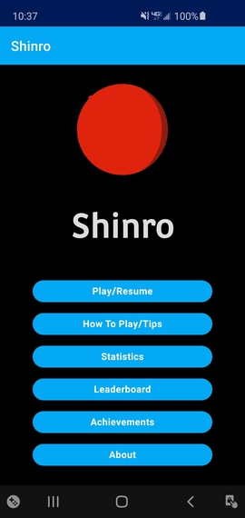
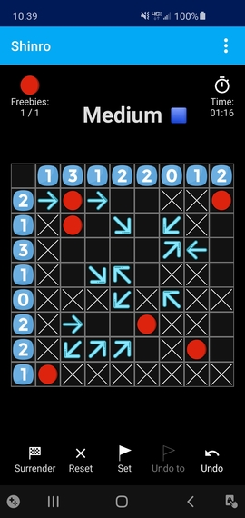
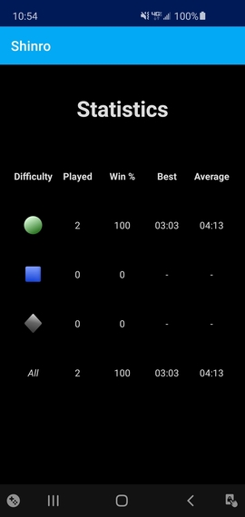
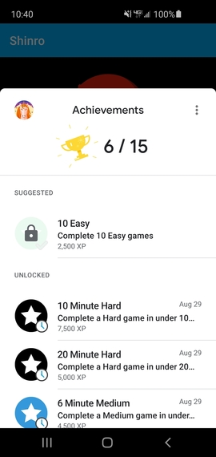
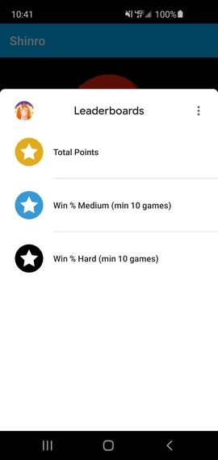
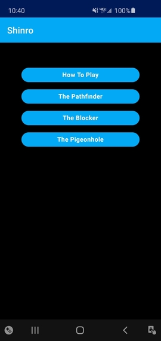
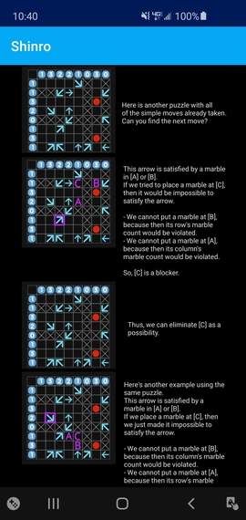
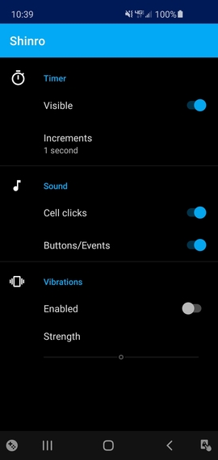

# Shinro
Android app for Shinro puzzle game

  
Shinro is a simple logic puzzle that first appeared in Japanese puzzle magazines. The puzzle company Puzzability discovered the puzzles and coined the name Shinro, which is a Japanese word that means "compass bearing." The company created an international sensation by publishing the puzzles in Spirit, the in-flight magazine of Southwest Airlines. The puzzle's simple rules, and its similarities to Sudoku and Minesweeper, make it very appealing to puzzle enthusiasts. 
  
A Shinro puzzle is an 8x8 grid. The goal is to locate 12 hidden marbles, based on the clues in the puzzle (numbers and arrows). A number on the top tells you how many marbles there are in each column underneath the number. A number on the side tells you how many marbles are in the row next to the number. Each arrow on the puzzle board points to at least one hidden marble. Not every marble has an arrow pointing to it.
  
This app is a win/loss game mode; the player is timed and completes boards for points. Progress is recorded and the resulting statistics are always available to view. Key statistics and achievements are published via a Google Games account. Users are provided a small set of custom in-game settings.  There are instructions on how to play (including a video), as well as some advanced tips for some of the harder puzzles.

Much of this app's content (puzzles, tips) were ported from [PlayShinro](http://playshinro.com). Many thanks to David Oranchak for providing this content.

## SCREENSHOTS
<i>Title Screen</i> 

<i>Puzzle</i> 

 

<i>Statistics</i> 

 

<i>Achievements</i> 

 

<i>Leaderboard</i> 

 

<i>Tips</i> 

 

<i>Blocker</i> 

 

<i>Settings</i> 

 

